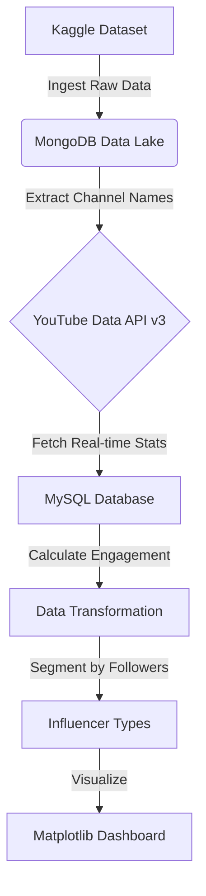

# 📢 Top 10 Influencers Worth Advertising With (Social Media Analytics)

A data analytics pipeline designed to identify high-potential influencers for marketing campaigns. This project integrates static datasets with real-time API data to calculate engagement rates and segment influencers based on their audience size.

## 🏗️ System Architecture & Logic

The project follows a **Hybrid Database Architecture**, utilizing MongoDB as a Data Lake for raw data and MySQL for structured, enriched data.

Canva presentation  : https://www.canva.com/design/DAGhmc_MCBc/DGPy8PQXSVmoqZ4bzs5ggA/edit?utm_content=DAGhmc_MCBc&utm_campaign=designshare&utm_medium=link2&utm_source=sharebutton  

Kaggle Data set : https://www.kaggle.com/datasets/ramjasmaurya/top-1000-social-media-channels
